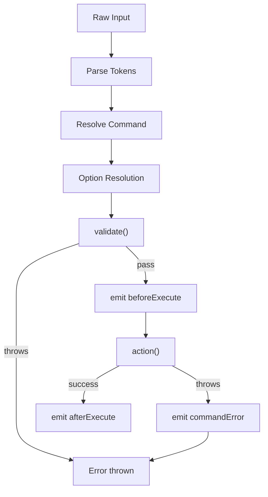
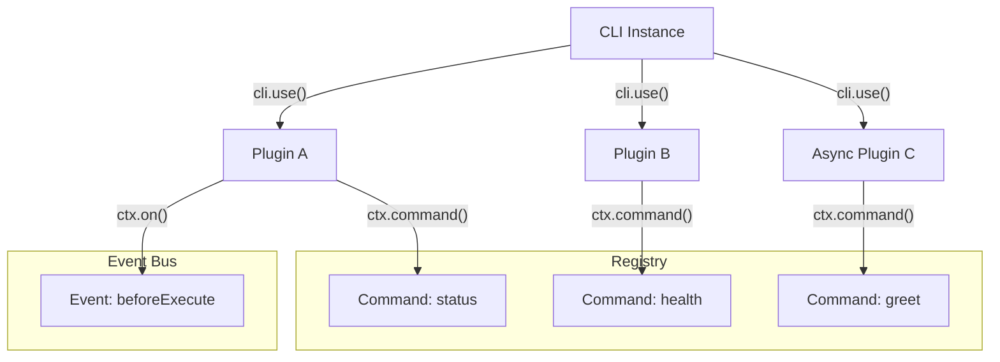
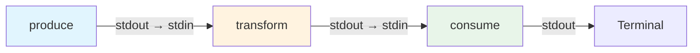
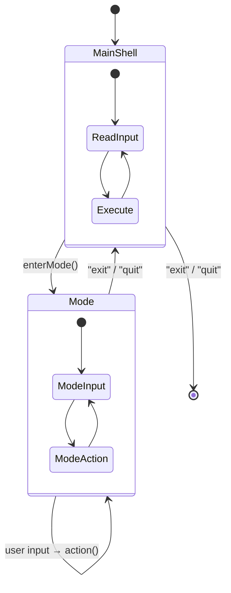

# Commands & Options

## Command Definition

Commands are defined using a definition string that specifies the command name and its positional arguments:

```
command <required> [optional] [...variadic]
parent child <arg>
```

- `<arg>` — Required argument
- `[arg]` — Optional argument
- `<...args>` — Required variadic (consumes all remaining)
- `[...args]` — Optional variadic

```typescript
cli.command("deploy <env> [region]")
  .action((ctx) => {
    // ctx.args.env    — always present
    // ctx.args.region — may be undefined
  });
```

## Options

### Option Flags

```typescript
.option("--verbose")                    // Boolean flag
.option("-f, --force")                  // Short alias + long
.option("-p, --port <port>")            // Takes value
.option("--tag <tag>", { type: "string" })
.option("-t, --timeout <ms>", { type: "number" })
```

### Option Schema

```typescript
interface OptionSchema {
  description?: string;
  type?: "string" | "number" | "boolean" | "string[]" | "number[]";
  alias?: string | string[];
  required?: boolean;
  default?: unknown;
  choices?: unknown[];
  parse?: (value: string, ctx: CommandContext) => unknown;
  validate?: (value: unknown, ctx: CommandContext) => void;
  hidden?: boolean;
}
```

### Examples

```typescript
.option("--env <env>", {
  type: "string",
  required: true,
  choices: ["dev", "staging", "prod"],
  description: "Target environment",
})

.option("--retries <n>", {
  type: "number",
  default: 3,
  validate: (v) => {
    if ((v as number) < 0) throw new Error("Must be non-negative");
  },
})

.option("--tags <tag>", {
  type: "string[]",
  description: "Tags (can be specified multiple times)",
})

.option("--date <date>", {
  type: "string",
  parse: (v) => new Date(v),
})
```

### Option Parsing Behavior

| Input | Result |
|-------|--------|
| `--force` | `{ force: true }` |
| `--no-force` | `{ force: false }` |
| `--tag v2` | `{ tag: "v2" }` |
| `--tag=v2` | `{ tag: "v2" }` |
| `-t v2` | `{ t: "v2" }` (resolved to long name by resolver) |
| `-abc` | `{ a: true, b: true, c: true }` |
| `-- --not-an-option` | Treated as positional arg |

## Command Aliases

```typescript
cli.command("deploy <env>")
  .alias("d", "dep")
  .action(/* ... */);

// All of these work:
// myapp deploy prod
// myapp d prod
// myapp dep prod
```

Aliases also work for subcommands:

```typescript
const user = cli.command("user");
user.command("create <name>")
  .alias("c", "new")
  .action(/* ... */);

// myapp user create Alice
// myapp user c Alice
// myapp user new Alice
```

## Command Validation

Pre-action validation that runs before event handlers:

```typescript
cli.command("deploy <env>")
  .validate((ctx) => {
    const env = ctx.args.env as string;
    if (!["prod", "staging", "dev"].includes(env)) {
      throw new Error(`Unknown environment: ${env}`);
    }
  })
  .action(/* ... */);
```

Async validation is supported:

```typescript
.validate(async (ctx) => {
  const exists = await checkEnvironment(ctx.args.env as string);
  if (!exists) throw new Error("Environment not found");
})
```

## Command Removal

Commands can be dynamically removed:

```typescript
const builder = cli.command("temporary").action(/* ... */);

// Later:
builder.remove(); // Returns true if found and removed
```

## Event System

Register lifecycle event handlers on the CLI instance:

```typescript
cli.on("beforeExecute", (ctx) => {
  // Runs before every command action
});

cli.on("afterExecute", (ctx) => {
  // Runs after successful command execution
});

cli.on("commandError", (error, ctx) => {
  // Runs when a command action throws
  // The error is still re-thrown after handlers run
});

cli.on("exit", () => {
  // Runs when the interactive shell exits
});
```

Remove handlers with `off()`:

```typescript
const handler = (ctx) => { /* ... */ };
cli.on("beforeExecute", handler);
cli.off("beforeExecute", handler);
```

**Execution order:**



## Catch / Fallback Command

Handle unrecognized commands instead of throwing `CommandNotFoundError`:

```typescript
cli.catch((input, { stdout }) => {
  stdout.write(`Unknown command: ${input}\nType "help" for available commands.\n`);
});
```

## Programmatic Execution

Execute commands programmatically:

```typescript
await cli.exec("deploy prod --force");
await cli.exec("user create Alice", {
  stdout: customStream,
  stderr: customStream,
});
```

## Plugin System



Extend the CLI with reusable plugins:

```typescript
function myPlugin(ctx: PluginContext) {
  ctx.command("status")
    .description("Show status")
    .action((cmdCtx) => {
      cmdCtx.stdout.write("All systems operational\n");
    });

  ctx.on("beforeExecute", (cmdCtx) => {
    // Add logging, metrics, etc.
  });
}

cli.use(myPlugin);
```

The `PluginContext` interface:

```typescript
interface PluginContext {
  command(definition: string): CommandBuilder;
  on<K extends keyof CLIEventMap>(event: K, handler: CLIEventMap[K]): void;
}
```

Async plugins are awaited when `cli.start()` is called.

## Pipe Commands

In the interactive shell, commands can be piped together:

```
> produce | transform | consume
```



The stdout of each command becomes the stdin of the next. Access stdin in your action:

```typescript
cli.command("uppercase")
  .action(async (ctx) => {
    if (ctx.stdin) {
      const chunks: Buffer[] = [];
      for await (const chunk of ctx.stdin) {
        chunks.push(Buffer.from(chunk));
      }
      const input = Buffer.concat(chunks).toString();
      ctx.stdout.write(input.toUpperCase());
    }
  });
```

## Mode Sub-REPL



Enter a specialized sub-REPL with its own prompt and handler:

```typescript
cli.command("sql").action((ctx) => {
  ctx.shell?.enterMode({
    prompt: "sql> ",
    message: "Entering SQL mode. Type 'exit' to return.",
    action: async (input, { stdout }) => {
      const result = await executeQuery(input);
      stdout.write(`${JSON.stringify(result)}\n`);
    },
  });
});
```

Type `exit` or `quit` to return to the main shell.

## Custom SIGINT Handler

Register a handler for when SIGINT (Ctrl+C) is received during command execution:

```typescript
cli.command("longrun")
  .cancel((ctx) => {
    // Clean up resources
    ctx.stdout.write("\nCancelled.\n");
  })
  .action(async (ctx) => {
    // Long running operation
  });
```

## Error Classes

| Error | Code | When |
|-------|------|------|
| `CommandNotFoundError` | `COMMAND_NOT_FOUND` | Unknown command |
| `MissingArgumentError` | `MISSING_ARGUMENT` | Required arg missing |
| `ExtraArgumentError` | `EXTRA_ARGUMENT` | Unexpected positional arg |
| `MissingOptionError` | `MISSING_OPTION` | Required option missing |
| `InvalidOptionError` | `INVALID_OPTION` | Wrong type or not in choices |
| `UnknownOptionError` | `UNKNOWN_OPTION` | Unrecognized flag |
| `ValidationError` | `VALIDATION_ERROR` | Custom validation failed |
| `PromptCancelError` | `PROMPT_CANCELLED` | User cancelled prompt |

All error classes extend `CLIError` which has a `code` property for programmatic handling.
