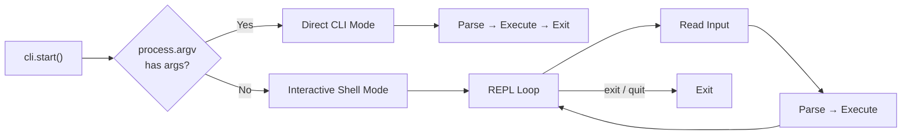

# Getting Started

## Installation

```bash
# npm
npm install @libraz/node-cli

# yarn
yarn add @libraz/node-cli

# pnpm
pnpm add @libraz/node-cli
```

**Requirements:**
- Node.js >= 20
- ESM (`"type": "module"` in your package.json)

## Basic Usage

```typescript
import { createCLI } from "@libraz/node-cli";

const cli = createCLI({ name: "myapp", version: "1.0.0" });

cli
  .command("greet <name>")
  .description("Greet someone by name")
  .option("-u, --uppercase", { type: "boolean" })
  .action((ctx) => {
    const name = ctx.args.name as string;
    const msg = ctx.options.uppercase ? name.toUpperCase() : name;
    ctx.stdout.write(`Hello, ${msg}!\n`);
  });

cli.start();
```

## Dual Execution Modes

node-cli supports two execution modes determined automatically:



### Direct CLI Mode

When command-line arguments are provided:

```bash
$ myapp greet World --uppercase
Hello, WORLD!
```

### Interactive Shell Mode

When no arguments are provided, an interactive REPL starts:

```bash
$ myapp
myapp v1.0.0
> greet World
Hello, World!
> help
myapp v1.0.0

Available commands:

  greet <name>    Greet someone by name
  help [...command]    Show help information

Type "help <command>" for more information.
> exit
```

The interactive shell provides:
- Command history (persisted to disk)
- Tab completion for commands, subcommands, and options
- Built-in `help`, `exit`, and `quit` commands

## CLI Configuration

```typescript
const cli = createCLI({
  name: "myapp",         // Application name (default: "cli")
  version: "1.0.0",      // Version string
  description: "My awesome CLI tool",  // Shown in help header
  banner: "Welcome to myapp!",         // Shown when shell starts ("" to suppress)
  prompt: "myapp> ",     // Shell prompt (default: "> ")
  historyFile: ".myapp_history",  // History file path
  historySize: 500,      // Max history entries (default: 1000)
});
```

If `banner` is not set, it defaults to `"{name} v{version}"`. Set it to `""` to suppress the banner entirely.

## Defining Commands

### Simple Command

```typescript
cli
  .command("ping")
  .description("Check connectivity")
  .action((ctx) => {
    ctx.stdout.write("pong\n");
  });
```

### Command with Arguments

```typescript
// Required argument: <name>
// Optional argument: [title]
cli
  .command("greet <name> [title]")
  .action((ctx) => {
    const title = ctx.args.title ? `${ctx.args.title} ` : "";
    ctx.stdout.write(`Hello, ${title}${ctx.args.name}!\n`);
  });
```

### Variadic Arguments

```typescript
cli
  .command("copy <...files>")
  .description("Copy files")
  .action((ctx) => {
    const files = ctx.args.files as string[];
    ctx.stdout.write(`Copying: ${files.join(", ")}\n`);
  });
```

### Command with Options

```typescript
cli
  .command("serve")
  .option("-p, --port <port>", {
    type: "number",
    default: 3000,
    description: "Port to listen on",
  })
  .option("--host <host>", {
    type: "string",
    default: "localhost",
  })
  .option("--cors", {
    type: "boolean",
    description: "Enable CORS",
  })
  .action((ctx) => {
    ctx.stdout.write(`Listening on ${ctx.options.host}:${ctx.options.port}\n`);
  });
```

### Subcommands

```typescript
const db = cli.command("db").description("Database operations");

db.command("migrate")
  .description("Run migrations")
  .action(async (ctx) => {
    ctx.stdout.write("Running migrations...\n");
  });

db.command("seed")
  .description("Seed database")
  .action(async (ctx) => {
    ctx.stdout.write("Seeding database...\n");
  });
```

## Command Context

Every action handler receives a `CommandContext` object:

```typescript
interface CommandContext {
  args: Record<string, unknown>;     // Parsed positional arguments
  options: Record<string, unknown>;  // Parsed options
  rawInput: string;                  // Original input string
  commandPath: string[];             // e.g., ["db", "migrate"]
  shell: Shell | null;               // Shell instance (null in direct mode)
  stdin: Readable | null;            // stdin (available in piped commands)
  stdout: Writable;                  // stdout stream
  stderr: Writable;                  // stderr stream
}
```

**Important:** Always use `ctx.stdout` and `ctx.stderr` instead of `console.log` / `process.stdout` to ensure proper output routing in pipe chains and testing.

## Next Steps

- [Commands & Options](commands.md) — Full command system reference
- [Output Utilities](output.md) — Color, table, progress, prompt, logger
- [API Reference](api.md) — Complete API documentation
