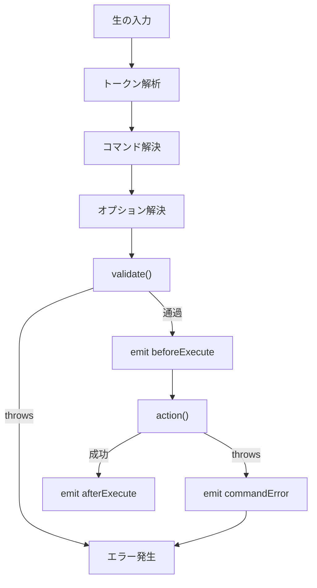
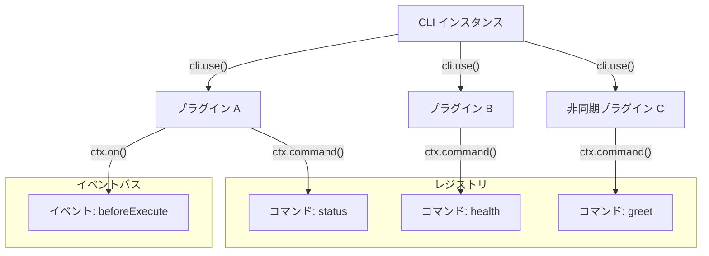
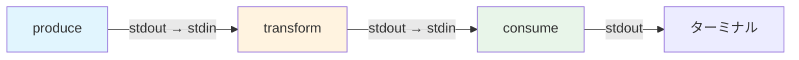
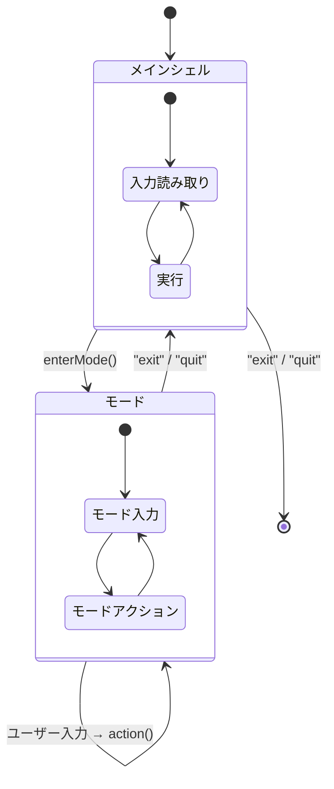

# コマンド & オプション

## コマンド定義

コマンドは、コマンド名と位置引数を指定する定義文字列で定義します:

```
command <required> [optional] [...variadic]
parent child <arg>
```

- `<arg>` — 必須引数
- `[arg]` — オプション引数
- `<...args>` — 必須可変長 (残りのすべてを受け取る)
- `[...args]` — オプション可変長

```typescript
cli.command("deploy <env> [region]")
  .action((ctx) => {
    // ctx.args.env    — 常に存在
    // ctx.args.region — undefined の場合あり
  });
```

## オプション

### オプションフラグ

```typescript
.option("--verbose")                    // ブールフラグ
.option("-f, --force")                  // 短縮エイリアス + ロング
.option("-p, --port <port>")            // 値を取る
.option("--tag <tag>", { type: "string" })
.option("-t, --timeout <ms>", { type: "number" })
```

### オプションスキーマ

```typescript
interface OptionSchema {
  description?: string;
  type?: "string" | "number" | "boolean" | "string[]" | "number[]";
  alias?: string | string[];
  required?: boolean;
  default?: unknown;
  choices?: unknown[];
  parse?: (value: string, ctx: CommandContext) => unknown;
  validate?: (value: unknown, ctx: CommandContext) => void;
  hidden?: boolean;
}
```

### 使用例

```typescript
.option("--env <env>", {
  type: "string",
  required: true,
  choices: ["dev", "staging", "prod"],
  description: "ターゲット環境",
})

.option("--retries <n>", {
  type: "number",
  default: 3,
  validate: (v) => {
    if ((v as number) < 0) throw new Error("0以上の値を指定してください");
  },
})

.option("--tags <tag>", {
  type: "string[]",
  description: "タグ (複数回指定可能)",
})

.option("--date <date>", {
  type: "string",
  parse: (v) => new Date(v),
})
```

### オプションのパース動作

| 入力 | 結果 |
|------|------|
| `--force` | `{ force: true }` |
| `--no-force` | `{ force: false }` |
| `--tag v2` | `{ tag: "v2" }` |
| `--tag=v2` | `{ tag: "v2" }` |
| `-t v2` | `{ t: "v2" }` (リゾルバでロング名に解決) |
| `-abc` | `{ a: true, b: true, c: true }` |
| `-- --not-an-option` | 位置引数として扱われる |

## コマンドエイリアス

```typescript
cli.command("deploy <env>")
  .alias("d", "dep")
  .action(/* ... */);

// すべて動作:
// myapp deploy prod
// myapp d prod
// myapp dep prod
```

サブコマンドのエイリアスも対応:

```typescript
const user = cli.command("user");
user.command("create <name>")
  .alias("c", "new")
  .action(/* ... */);

// myapp user create Alice
// myapp user c Alice
// myapp user new Alice
```

## コマンドバリデーション

イベントハンドラの前に実行されるアクション前バリデーション:

```typescript
cli.command("deploy <env>")
  .validate((ctx) => {
    const env = ctx.args.env as string;
    if (!["prod", "staging", "dev"].includes(env)) {
      throw new Error(`不明な環境: ${env}`);
    }
  })
  .action(/* ... */);
```

非同期バリデーションにも対応:

```typescript
.validate(async (ctx) => {
  const exists = await checkEnvironment(ctx.args.env as string);
  if (!exists) throw new Error("環境が見つかりません");
})
```

## コマンドの削除

コマンドを動的に削除できます:

```typescript
const builder = cli.command("temporary").action(/* ... */);

// 後で:
builder.remove(); // 見つかって削除された場合 true を返す
```

## イベントシステム

CLI インスタンスにライフサイクルイベントハンドラを登録:

```typescript
cli.on("beforeExecute", (ctx) => {
  // すべてのコマンドアクションの前に実行
});

cli.on("afterExecute", (ctx) => {
  // コマンドが正常に実行された後
});

cli.on("commandError", (error, ctx) => {
  // コマンドアクションでエラーが発生した時
  // ハンドラ実行後もエラーは再度投げられる
});

cli.on("exit", () => {
  // インタラクティブシェル終了時
});
```

`off()` でハンドラを削除:

```typescript
const handler = (ctx) => { /* ... */ };
cli.on("beforeExecute", handler);
cli.off("beforeExecute", handler);
```

**実行順序:**



## キャッチ / フォールバックコマンド

`CommandNotFoundError` を投げる代わりに未認識のコマンドを処理:

```typescript
cli.catch((input, { stdout }) => {
  stdout.write(`不明なコマンド: ${input}\n"help" で使用可能なコマンドを確認できます。\n`);
});
```

## プログラム実行

コマンドをプログラムから実行:

```typescript
await cli.exec("deploy prod --force");
await cli.exec("user create Alice", {
  stdout: customStream,
  stderr: customStream,
});
```

## プラグインシステム



再利用可能なプラグインで CLI を拡張:

```typescript
function myPlugin(ctx: PluginContext) {
  ctx.command("status")
    .description("ステータスを表示")
    .action((cmdCtx) => {
      cmdCtx.stdout.write("全システム正常\n");
    });

  ctx.on("beforeExecute", (cmdCtx) => {
    // ログ、メトリクスなどを追加
  });
}

cli.use(myPlugin);
```

`PluginContext` インターフェース:

```typescript
interface PluginContext {
  command(definition: string): CommandBuilder;
  on<K extends keyof CLIEventMap>(event: K, handler: CLIEventMap[K]): void;
}
```

非同期プラグインは `cli.start()` 呼び出し時に await されます。

## パイプコマンド

インタラクティブシェルでコマンドをパイプでつなげられます:

```
> produce | transform | consume
```



各コマンドの stdout が次のコマンドの stdin になります。アクション内で stdin にアクセス:

```typescript
cli.command("uppercase")
  .action(async (ctx) => {
    if (ctx.stdin) {
      const chunks: Buffer[] = [];
      for await (const chunk of ctx.stdin) {
        chunks.push(Buffer.from(chunk));
      }
      const input = Buffer.concat(chunks).toString();
      ctx.stdout.write(input.toUpperCase());
    }
  });
```

## モードサブ REPL



独自のプロンプトとハンドラを持つ専用サブ REPL に入る:

```typescript
cli.command("sql").action((ctx) => {
  ctx.shell?.enterMode({
    prompt: "sql> ",
    message: "SQL モードに入ります。'exit' で戻ります。",
    action: async (input, { stdout }) => {
      const result = await executeQuery(input);
      stdout.write(`${JSON.stringify(result)}\n`);
    },
  });
});
```

`exit` または `quit` でメインシェルに戻ります。

## タブ補完

インタラクティブシェルでは、コマンド名、サブコマンド、オプションフラグの自動補完が動作します。

### オプション値の補完

`choices` を持つオプションは自動的に補完されます。`autocomplete` で明示的に候補を指定することもできます:

```typescript
cli.command("deploy <env>")
  .option("--region <region>", {
    autocomplete: ["us-east-1", "us-west-2", "eu-west-1"],
  })
  .option("--profile <profile>", {
    // 動的な補完（async 対応）
    autocomplete: async (current) => {
      const profiles = await loadProfiles();
      return profiles.map((p) => p.name);
    },
  });
```

### カスタムコマンド補完

`.complete()` でコマンドの引数に対するカスタム補完を提供できます:

```typescript
cli.command("connect <host>")
  .complete((ctx) => {
    return ["localhost", "example.com", "192.168.1.1"];
  })
  .action((ctx) => { /* ... */ });
```

### 段階的補完（Tab イテレーション）

`CompletionContext.iteration` で連続 Tab 押下回数を追跡し、段階的な補完が可能です:

```typescript
cli.command("ssh <host>")
  .complete((ctx) => {
    if (ctx.iteration === 1) {
      // 1回目の Tab: 最近のホストを表示
      return ["server-1", "server-2"];
    }
    // 2回目以降: すべてのホストを表示
    return ["server-1", "server-2", "server-3", "server-4", "server-5"];
  })
  .action((ctx) => { /* ... */ });
```

## カスタム SIGINT ハンドラ

コマンド実行中に SIGINT (Ctrl+C) を受信した時のハンドラを登録:

```typescript
cli.command("longrun")
  .cancel((ctx) => {
    // リソースのクリーンアップ
    ctx.stdout.write("\nキャンセルしました。\n");
  })
  .action(async (ctx) => {
    // 長時間実行される処理
  });
```

## エラークラス

| エラー | コード | 発生タイミング |
|--------|--------|---------------|
| `CommandNotFoundError` | `COMMAND_NOT_FOUND` | 不明なコマンド |
| `MissingArgumentError` | `MISSING_ARGUMENT` | 必須引数の不足 |
| `ExtraArgumentError` | `EXTRA_ARGUMENT` | 予期しない位置引数 |
| `MissingOptionError` | `MISSING_OPTION` | 必須オプションの不足 |
| `InvalidOptionError` | `INVALID_OPTION` | 型の不一致または選択肢外 |
| `UnknownOptionError` | `UNKNOWN_OPTION` | 未認識のフラグ |
| `ValidationError` | `VALIDATION_ERROR` | カスタムバリデーション失敗 |
| `PromptCancelError` | `PROMPT_CANCELLED` | プロンプトのキャンセル |

すべてのエラークラスは `CLIError` を継承し、プログラムによるハンドリング用の `code` プロパティを持ちます。
