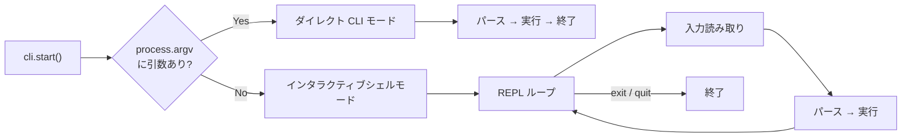

# はじめに

## インストール

```bash
# npm
npm install @libraz/node-cli

# yarn
yarn add @libraz/node-cli

# pnpm
pnpm add @libraz/node-cli
```

**動作要件:**
- Node.js >= 20
- ESM (package.json に `"type": "module"`)

## 基本的な使い方

```typescript
import { createCLI } from "@libraz/node-cli";

const cli = createCLI({ name: "myapp", version: "1.0.0" });

cli
  .command("greet <name>")
  .description("名前で挨拶する")
  .option("-u, --uppercase", { type: "boolean" })
  .action((ctx) => {
    const name = ctx.args.name as string;
    const msg = ctx.options.uppercase ? name.toUpperCase() : name;
    ctx.stdout.write(`Hello, ${msg}!\n`);
  });

cli.start();
```

## デュアル実行モード

node-cli はコマンドライン引数の有無で自動的にモードを切り替えます。



### ダイレクト CLI モード

コマンドライン引数がある場合:

```bash
$ myapp greet World --uppercase
Hello, WORLD!
```

### インタラクティブシェルモード

引数なしで起動すると REPL が開始:

```bash
$ myapp
myapp v1.0.0
> greet World
Hello, World!
> help
myapp v1.0.0

Available commands:

  greet <name>    名前で挨拶する
  help [...command]    Show help information

Type "help <command>" for more information.
> exit
```

インタラクティブシェルの機能:
- コマンド履歴 (ディスクに永続化)
- コマンド、サブコマンド、オプション、オプション値のタブ補完
- 組み込み `help`、`exit`、`quit` コマンド

## CLI 設定

```typescript
const cli = createCLI({
  name: "myapp",         // アプリケーション名 (デフォルト: "cli")
  version: "1.0.0",      // バージョン文字列
  description: "素晴らしい CLI ツール",  // ヘルプヘッダーに表示
  banner: "myapp へようこそ!",           // シェル起動時に表示 ("" で抑制)
  prompt: "myapp> ",     // シェルプロンプト (デフォルト: "> ")
  historyFile: ".myapp_history",  // 履歴ファイルパス
  historySize: 500,      // 最大履歴エントリ数 (デフォルト: 1000)
});
```

`banner` 未設定時は `"{name} v{version}"` が自動生成されます。`""` を設定するとバナーを完全に抑制します。

## コマンドの定義

### シンプルなコマンド

```typescript
cli
  .command("ping")
  .description("接続確認")
  .action((ctx) => {
    ctx.stdout.write("pong\n");
  });
```

### 引数付きコマンド

```typescript
// 必須引数: <name>
// オプション引数: [title]
cli
  .command("greet <name> [title]")
  .action((ctx) => {
    const title = ctx.args.title ? `${ctx.args.title} ` : "";
    ctx.stdout.write(`Hello, ${title}${ctx.args.name}!\n`);
  });
```

### 可変長引数

```typescript
cli
  .command("copy <...files>")
  .description("ファイルをコピー")
  .action((ctx) => {
    const files = ctx.args.files as string[];
    ctx.stdout.write(`コピー中: ${files.join(", ")}\n`);
  });
```

### オプション付きコマンド

```typescript
cli
  .command("serve")
  .option("-p, --port <port>", {
    type: "number",
    default: 3000,
    description: "リッスンするポート",
  })
  .option("--host <host>", {
    type: "string",
    default: "localhost",
  })
  .option("--cors", {
    type: "boolean",
    description: "CORS を有効化",
  })
  .action((ctx) => {
    ctx.stdout.write(`${ctx.options.host}:${ctx.options.port} でリッスン中\n`);
  });
```

### サブコマンド

```typescript
const db = cli.command("db").description("データベース操作");

db.command("migrate")
  .description("マイグレーションを実行")
  .action(async (ctx) => {
    ctx.stdout.write("マイグレーション実行中...\n");
  });

db.command("seed")
  .description("データベースをシード")
  .action(async (ctx) => {
    ctx.stdout.write("シーディング中...\n");
  });
```

## コマンドコンテキスト

すべてのアクションハンドラは `CommandContext` オブジェクトを受け取ります:

```typescript
interface CommandContext {
  args: Record<string, unknown>;     // パースされた位置引数
  options: Record<string, unknown>;  // パースされたオプション
  rawInput: string;                  // 元の入力文字列
  commandPath: string[];             // 例: ["db", "migrate"]
  shell: Shell | null;               // Shell インスタンス (ダイレクトモードでは null)
  stdin: Readable | null;            // stdin (パイプコマンドで利用可能)
  stdout: Writable;                  // stdout ストリーム
  stderr: Writable;                  // stderr ストリーム
}
```

**重要:** パイプチェーンやテストで正しく出力をルーティングするため、`console.log` / `process.stdout` ではなく `ctx.stdout` と `ctx.stderr` を使用してください。

## 次のステップ

- [コマンド & オプション](commands.md) — コマンドシステムの完全リファレンス
- [出力ユーティリティ](output.md) — カラー、テーブル、プログレス、プロンプト、ロガー
- [API リファレンス](api.md) — 完全な API ドキュメント
